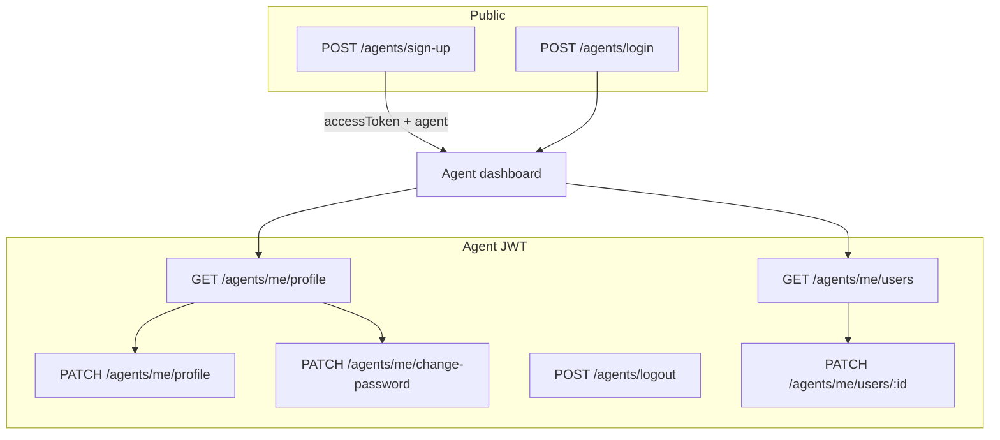

# Agent Signup, Profile & Password — Implementation Guide

> **Backend source of truth:** `api/src/controllers/agent.controller.ts`, `api/src/dto/agent.dto.ts`  
> **Do not modify** the `api/` folder from the frontend repo — consume these endpoints as documented below.

## Overview

Two agent onboarding paths:

| Flow | Who | Endpoint |
|------|-----|----------|
| **Self sign-up** | New agent (public) | `POST /agents/sign-up` |
| **Admin create** | Super admin / admin | `POST /agents` |

After login, agents manage their own account via:

- `GET /agents/me/profile` — read profile
- `PATCH /agents/me/profile` — update profile
- `PATCH /agents/me/change-password` — change password

Agents also manage users assigned to them via:

- `GET /agents/me/users` — list users (ordered by `createdAt` DESC)
- `GET /agents/me/users/:id` — get one user
- `PATCH /agents/me/users/:id` — update user
- `DELETE /agents/me/users/:id` — delete user



---

## Agent type

```ts
type Agent = {
  id: string;
  agentLoginId: string;
  firstName: string;
  lastName: string;
  phoneNumber: string | null;
  email: string | null;
  isActive: boolean;
  state: string | null;
  city: string | null;
  lastLogin: string | null;
  createdById: string | null;
  createdAt: string;
  updatedAt: string;
};
```

Display name: `` `${firstName} ${lastName}` ``

---

## Endpoints

### `POST /agents/sign-up` (public)

**Rate limit:** 5/min

**Body:**

```json
{
  "firstName": "Jane",
  "lastName": "Agent",
  "phoneNumber": "9876543210",
  "email": "jane@example.com",
  "state": "Gujarat",
  "city": "Ahmedabad",
  "password": "securePass1"
}
```

| Field | Required | Rules |
|-------|----------|-------|
| `firstName` | Yes | 1–255 chars |
| `lastName` | Yes | 1–255 chars |
| `phoneNumber` | Yes | Exactly 10 digits |
| `email` | Yes | Valid email |
| `state` | Yes | 1–100 chars (name string) |
| `city` | Yes | 1–100 chars (name string) |
| `password` | Yes | Min 8, 1 letter, 1 number |

**Success `200`:**

```json
{
  "accessToken": "eyJ...",
  "agent": { /* Agent */ }
}
```

**Errors:** `409` email or phone already exists.

---

### `POST /agents/login` (public)

**Body:** `{ "agentLoginId", "password" }`  
**Success:** `{ accessToken, agent }`

---

### `GET /agents/me/profile` (agent JWT)

Returns the authenticated agent (no password).

---

### `PATCH /agents/me/profile` (agent JWT)

**Body** (at least one field):

```json
{
  "firstName": "Jane",
  "lastName": "Smith",
  "phoneNumber": "9876543210",
  "email": "jane@example.com",
  "state": "Gujarat",
  "city": "Surat"
}
```

**Success:** updated `Agent`.

---

### `PATCH /agents/me/change-password` (agent JWT)

> **Note:** Path is `me/change-password`, not `me/password`.

**Body:**

```json
{
  "currentPassword": "oldpass1",
  "newPassword": "newpass2"
}
```

**Success:** `{ "message": "Password changed successfully" }`

---

### Admin: `POST /agents` / `PATCH /agents/:id`

Same field names as profile (`firstName`, `lastName`, `phoneNumber`, `email`, `state`, `city`). Admin create auto-generates `agentLoginId` and password.

---

## Frontend routes

| Route | Page | Auth |
|-------|------|------|
| `/agent/sign-up` | Agent sign-up form | Public |
| `/agent/login` | Agent login | Public |
| `/agent/profile` | View/edit profile | Agent |
| `/agent/change-password` | Change password | Agent |
| `/admin/agents` | Admin agent CRUD | Admin |

---

## My Users (agent portal)

**Route:** `/agent/customers` (sidebar: "My Users")  
**Page:** `src/pages/Agent/MyUsers.tsx`  
**Backend:** `api/src/controllers/agent.controller.ts` (lines 93–133), `UpdateUserSchema` in `api/src/dto/user.dto.ts`

| Method | Path | Auth | Response |
|--------|------|------|----------|
| `GET` | `/agents/me/users` | Agent JWT | `ReferralUser[]` |
| `GET` | `/agents/me/users/:id` | Agent JWT | `ReferralUser` |
| `PATCH` | `/agents/me/users/:id` | Agent JWT | Updated `ReferralUser` |
| `DELETE` | `/agents/me/users/:id` | Agent JWT | `{ message: string }` |

**User shape** (matches `ReferralUser` in `src/types/api.ts`):

```ts
{
  id, agentId, firstName, lastName, phoneNumber, email, createdAt, updatedAt
}
```

**PATCH body** — at least one field:

```json
{
  "firstName": "John",
  "lastName": "Doe",
  "phoneNumber": "9876543210",
  "email": "john@example.com"
}
```

**Errors:** `404` if user not found or not assigned to logged-in agent; `409` if phone/email already exists on update.

**Frontend service:** `listMyUsers`, `getMyUser`, `updateMyUser`, `deleteMyUser` in `src/services/agents.service.ts`

---

## Frontend files

| File | Role |
|------|------|
| `src/types/api.ts` | `Agent`, payloads, `formatAgentName()` |
| `src/services/agents.service.ts` | `agentSignUp`, `getAgentProfile`, `updateAgentProfile`, `listMyUsers`, `getMyUser`, `updateMyUser`, `deleteMyUser` |
| `src/services/auth.service.ts` | `changeAgentPassword` → `/agents/me/change-password` |
| `src/pages/Agent/AgentSignUp.tsx` | Public registration |
| `src/pages/Agent/AgentProfile.tsx` | Profile load/save |
| `src/pages/Agent/MyUsers.tsx` | My Users list, edit, delete |
| `src/pages/Admin/Agents.tsx` | firstName/lastName admin forms |
| `src/context/AuthContext.tsx` | Session name from first + last |

---

## i18n keys

- `agent.signup.*` — sign-up page
- `agent.profile.*` — profile page
- `agent.my_users.*` — My Users page

See `src/locales/{en,hi,gu}/translation.json`.

---

## Implementation checklist

- [x] Types aligned with `agent.dto.ts`
- [x] Service layer for sign-up, profile, change-password URL fix
- [x] Admin Agents page: firstName / lastName / phoneNumber
- [x] Agent sign-up page + route
- [x] Agent profile page + change-password route
- [x] RegisterUser agent list display
- [x] AuthContext display name
- [x] My Users page wired to `/agents/me/users` CRUD
- [x] Types: `UpdateUserPayload`, `formatUserName()`

---

## Related docs

- [API_REFERENCE.md](./API_REFERENCE.md) — may be outdated for agent `name`/`phone` fields
- [../api/docs/api-reference.md](../api/docs/api-reference.md) — backend Swagger companion
